# Design Language

Visual reference for poe-code CLI design elements.

This document is auto-generated. Run `npm run generate:design-docs` to regenerate.

## Package Overview

The `toolcraft-design` package provides consistent visual styling for the poe-code CLI.

```typescript
// Import components
import { text, symbols, intro, outro, log } from "toolcraft-design";

// Import tokens for advanced customization
import { brand, dark, light, spacing, typography, widths } from "toolcraft-design";
```

## Design Tokens

Foundational values that ensure consistency:

| Token               | Value     | Description                      |
| ------------------- | --------- | -------------------------------- |
| `brand`             | `#a200ff` | Primary brand color (Poe purple) |
| `spacing.sm`        | `1`       | Small spacing unit               |
| `spacing.md`        | `2`       | Medium spacing unit              |
| `spacing.lg`        | `4`       | Large spacing unit               |
| `widths.header`     | `60`      | Header line width                |
| `widths.helpColumn` | `24`      | Help text column width           |
| `widths.maxLine`    | `80`      | Maximum line width               |

## Theme Palettes

The design system supports dark and light themes, auto-detected from environment:

```typescript
import { getTheme, resolveThemeName } from "toolcraft-design";

const themeName = resolveThemeName(); // 'dark' or 'light'
const palette = getTheme();
console.log(palette.header("Title"));
```

**Environment variables checked (in order):**

- `POE_CODE_THEME` - explicit override ('dark' or 'light')
- `APPLE_INTERFACE_STYLE` - macOS appearance
- `VSCODE_COLOR_THEME_KIND` - VS Code theme
- `COLORFGBG` - terminal color hint

## Layout Patterns

Standard command layout patterns. These show complete UI flows from start to finish.

### layout-basic

Core layout: intro banner, info messages, resolved prompts, success message

```typescript
import { intro, outro, log, symbols } from "toolcraft-design";

intro("Configure");
log.message("Configuring...", { symbol: symbols.info });
log.message("Provider\n   claude", { symbol: symbols.resolved });
log.message("API Key\n   poe-abc...xyz", { symbol: symbols.resolved });
outro("Configuration complete.");
```

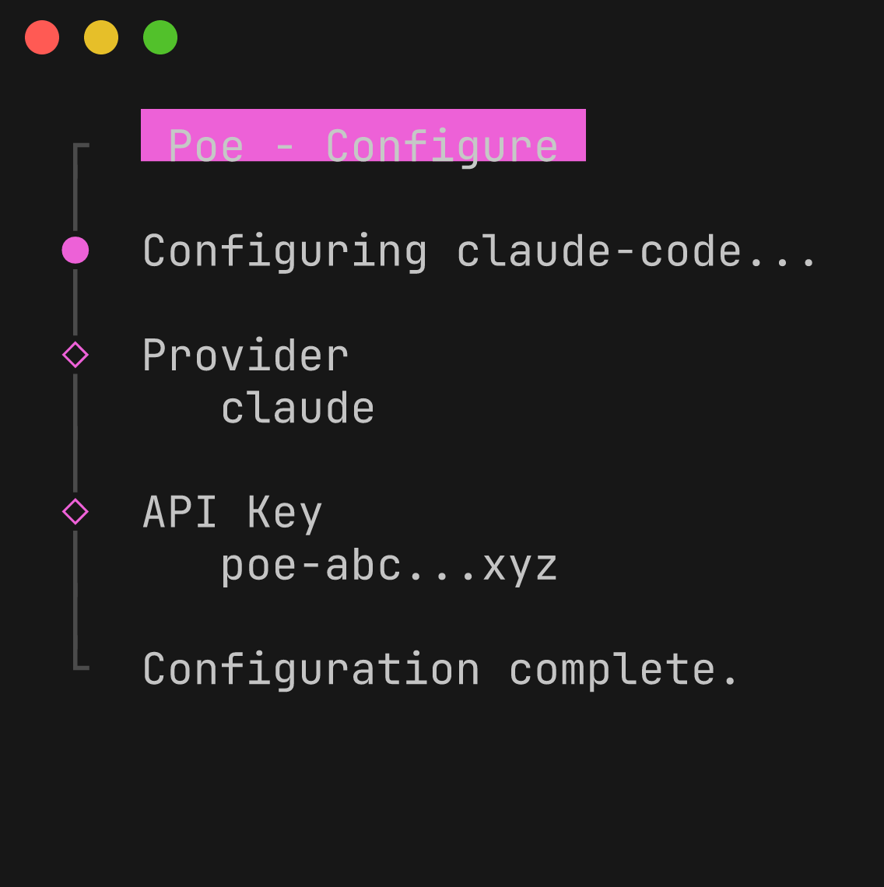

### layout-expanded

Full layout with note and outro: intro, resolved prompts, success, note box, outro

```typescript
import { intro, outro, note, log, symbols } from "toolcraft-design";

intro("configure claude-code");
log.message("Claude Code default model\n   <model-id>", { symbol: symbols.resolved });
log.message("Configured Claude Code.", { symbol: symbols.success });
note("If using VSCode...\nvscode://settings/...", "Next steps.");
outro("Problems? https://...");
```

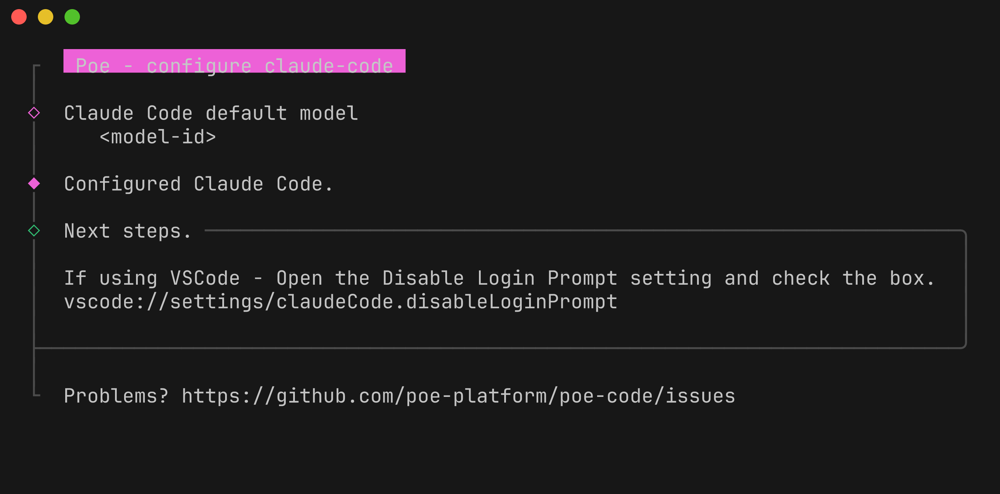

## Text Styles

Semantic text styling functions for consistent CLI output. Import from `toolcraft-design`.

### intro

Prominent introductory banners with brand background

```typescript
import { text } from "toolcraft-design";
text.intro("Configure");
```

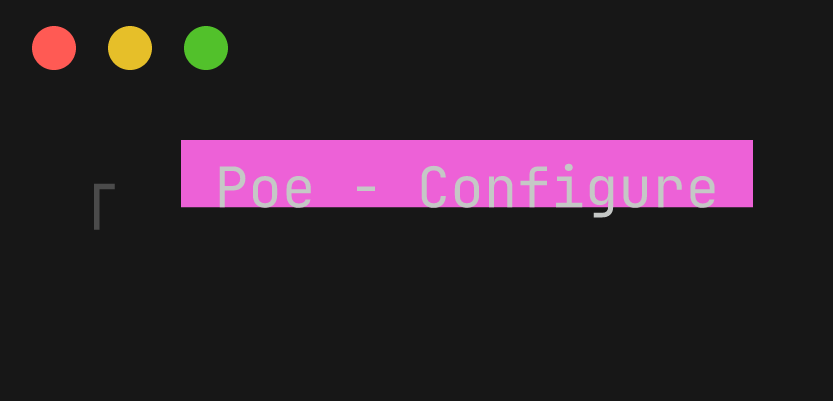

### heading

Section headings with brand accent color

```typescript
import { text } from "toolcraft-design";
text.heading("Available Commands");
```

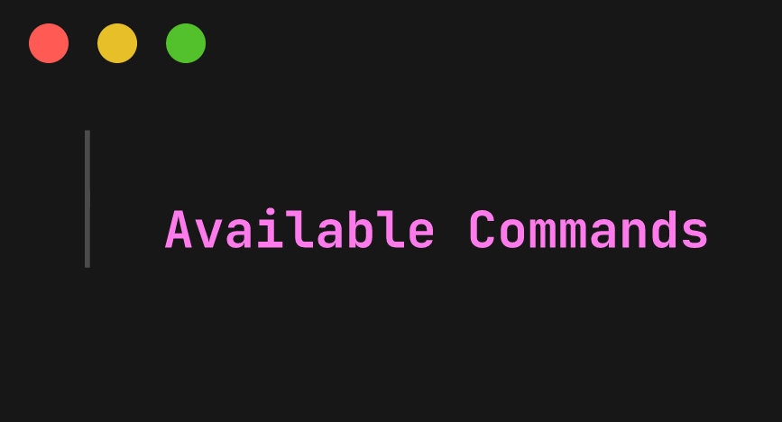

### section

Bold text for subsection labels

```typescript
import { text } from "toolcraft-design";
text.section("Options:");
```

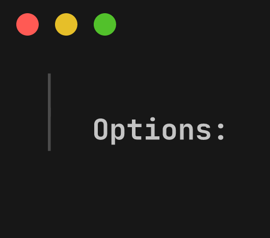

### command

CLI command names in accent color

```typescript
import { text } from "toolcraft-design";
text.command("poe-code configure");
```

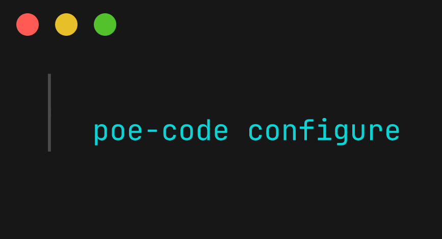

### argument

Command arguments (dimmed)

```typescript
import { text } from "toolcraft-design";
text.argument("<provider>");
```

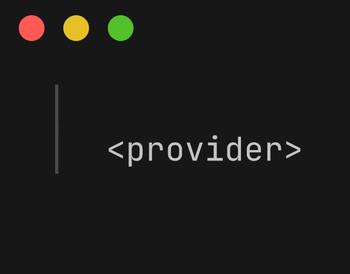

### option

CLI flags and options in yellow

```typescript
import { text } from "toolcraft-design";
text.option("--dry-run");
```

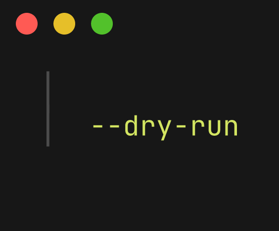

### example

Example text (dimmed)

```typescript
import { text } from "toolcraft-design";
text.example("$ poe-code configure claude");
```

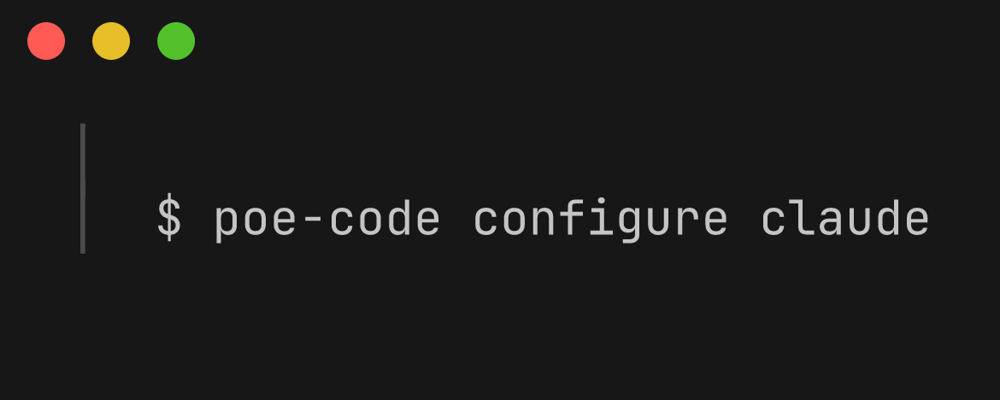

### usageCommand

Commands in usage examples (green)

```typescript
import { text } from "toolcraft-design";
text.usageCommand("npm install -g poe-code");
```

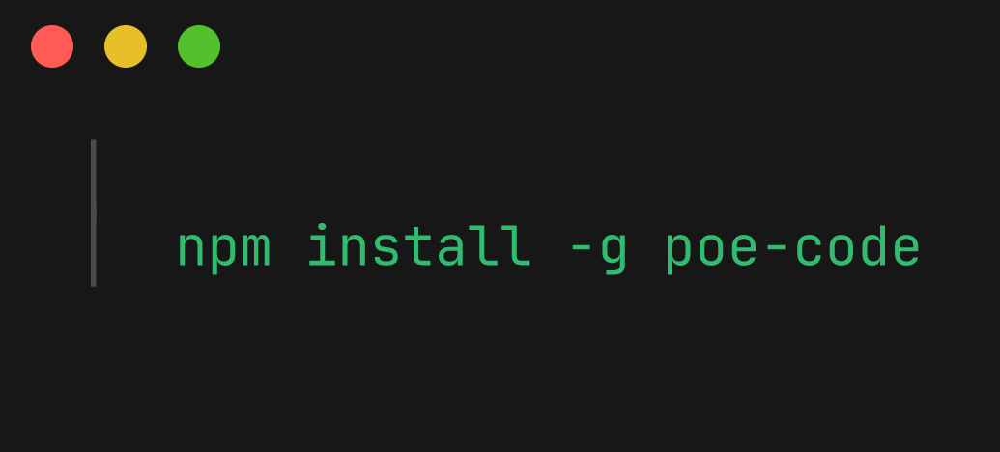

### link

Hyperlinks and references

```typescript
import { text } from "toolcraft-design";
text.link("https://poe.com");
```

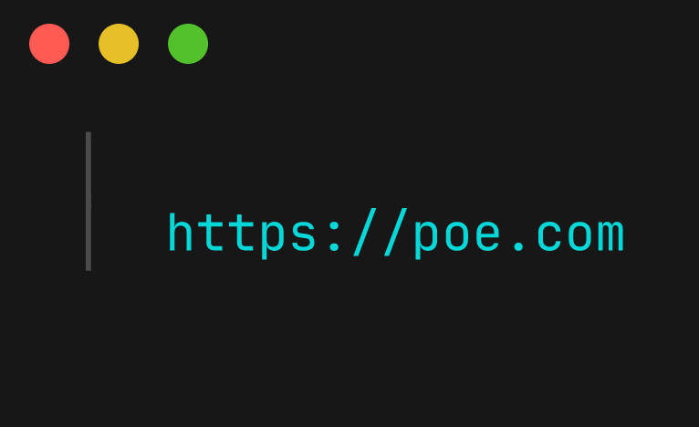

### muted

De-emphasized text

```typescript
import { text } from "toolcraft-design";
text.muted("(optional)");
```

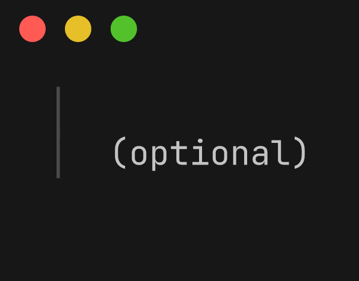

## Symbols

Status indicators and visual markers. Use with `log.message()` for structured output.

### info

Information indicator (magenta dot)

```typescript
import { log, symbols } from "toolcraft-design";
log.message("Configuring claude-code...", { symbol: symbols.info });
```

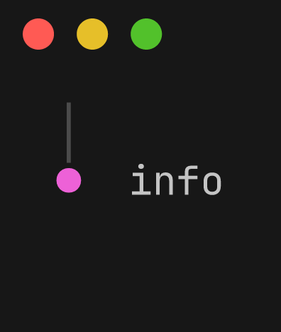

### success

Success indicator (magenta diamond)

```typescript
import { log, symbols } from "toolcraft-design";
log.message("Configuration complete!", { symbol: symbols.success });
```

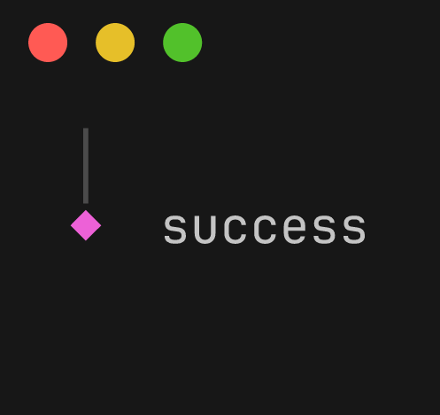

### resolved

Resolved/completed indicator (hollow diamond)

```typescript
import { log, symbols } from "toolcraft-design";
log.message("API Key\n   poe-abc...xyz", { symbol: symbols.resolved });
```

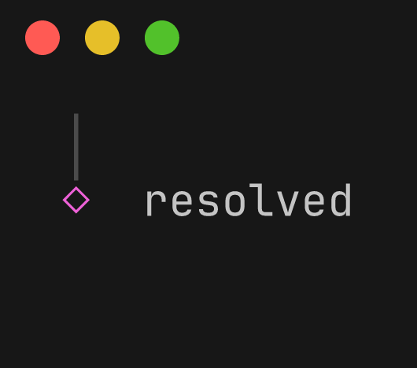

### errorResolved

Error with details indicator (red square)

```typescript
import { log, symbols } from "toolcraft-design";
log.message("Config Failed\n   Missing API key", { symbol: symbols.errorResolved });
```

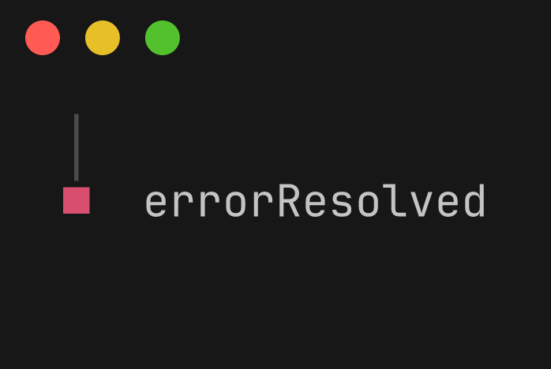

## Log Messages

Structured logging with appropriate visual weight. Import `log` from the prompts module.

### log-info

Informational messages during operations

```typescript
import { log, symbols } from "toolcraft-design";
log.message("Configuring claude-code...", { symbol: symbols.info });
```

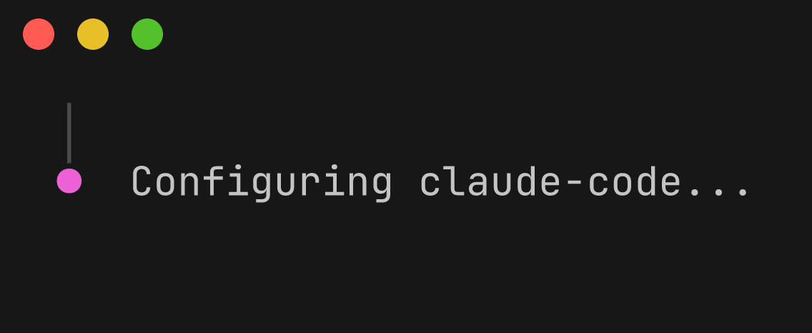

### log-success

Success confirmation messages

```typescript
import { log, symbols } from "toolcraft-design";
log.message("Configuration complete!", { symbol: symbols.success });
```

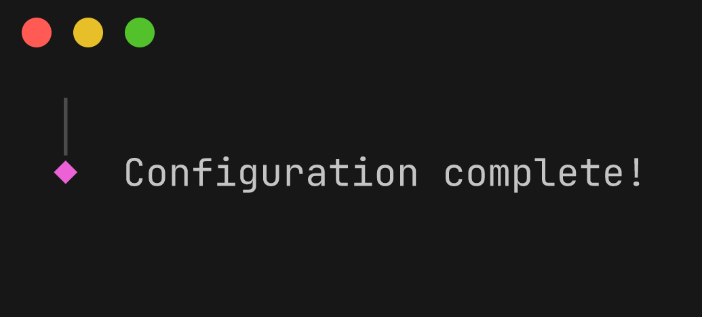

### log-warn

Warning messages for non-critical issues

```typescript
import { log } from "toolcraft-design";
log.warn("API key expires in 7 days");
```

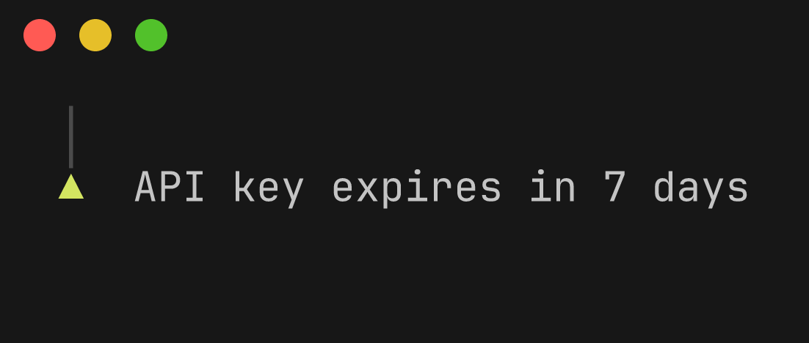

### log-error

Error messages for failures

```typescript
import { log } from "toolcraft-design";
log.error("Failed to write config file");
```

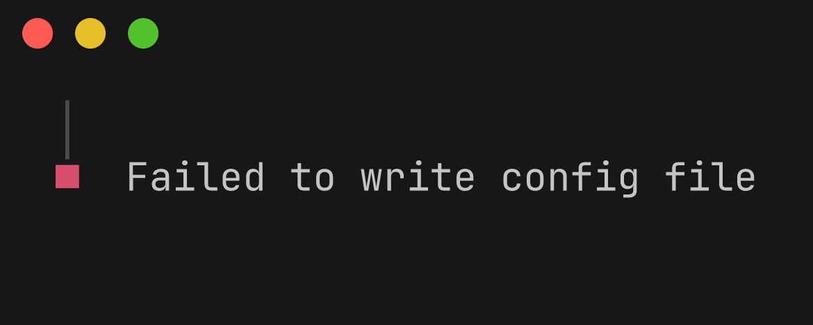

## Prompts

Interactive prompts for user input. Import from `toolcraft-design`.

### prompt-intro

Command intro banner with animation

```typescript
import { intro } from "toolcraft-design";
intro("Configure");
```


### prompt-note

Boxed note for next steps or important info

```typescript
import { note } from "toolcraft-design";
note("Run poe-code test", "Next steps.");
```

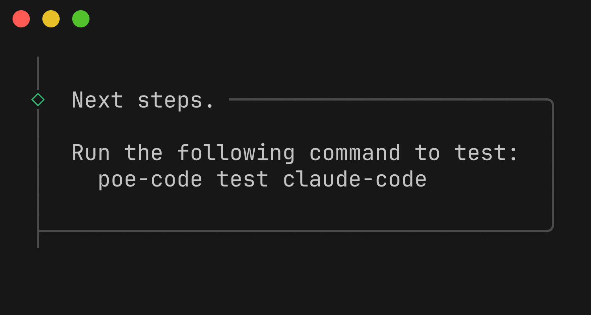

### prompt-outro

Command outro with feedback link

```typescript
import { outro } from "toolcraft-design";
outro("Problems? https://...");
```

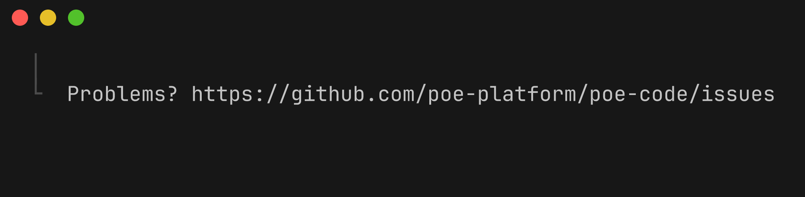

### prompt-resolved

Resolved prompt value display

```typescript
import { log, symbols } from "toolcraft-design";
log.message("API Key\n   poe-abc...xyz", { symbol: symbols.resolved });
```

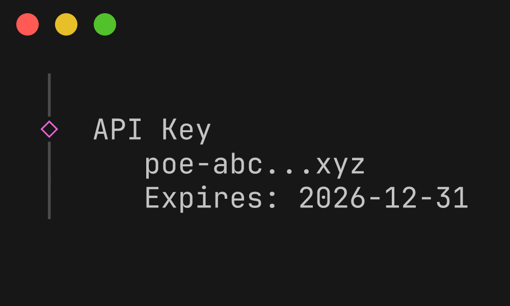

### prompt-errorResolved

Error with details display

```typescript
import { log, symbols } from "toolcraft-design";
log.message("Config Failed\n   Missing API key", { symbol: symbols.errorResolved });
```

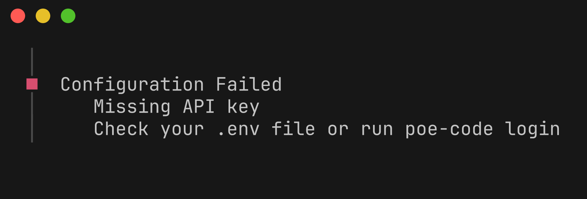

### menu

Interactive select prompt for choosing options

```typescript
import { select } from "toolcraft-design";
const choice = await select({
  message: "Pick an agent:",
  options: [
    { value: "claude-code", label: "Claude Code" },
    { value: "codex", label: "Codex CLI" }
  ]
});
```

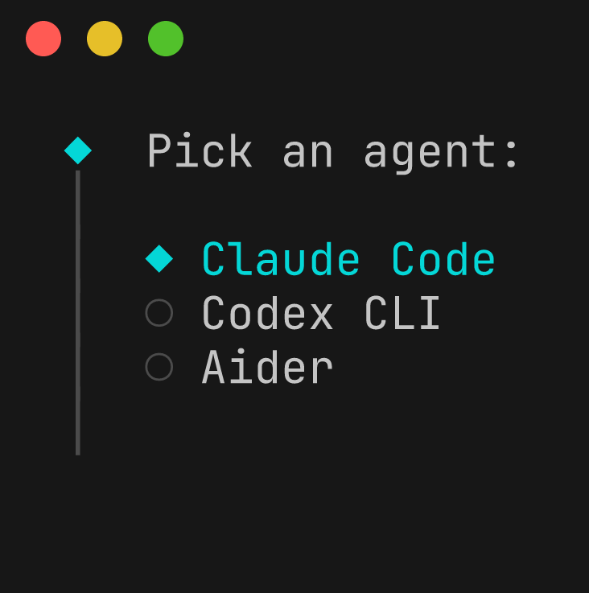

## Static Rendering

Utilities for rendering UI elements as static strings (for screenshots, tests, or non-interactive output).

### spinner-dots

Animated dots spinner for async operations

```typescript
import { spinner } from "toolcraft-design";
const s = spinner();
s.start("Configuring...");
await doWork();
s.stop("Done!");
```

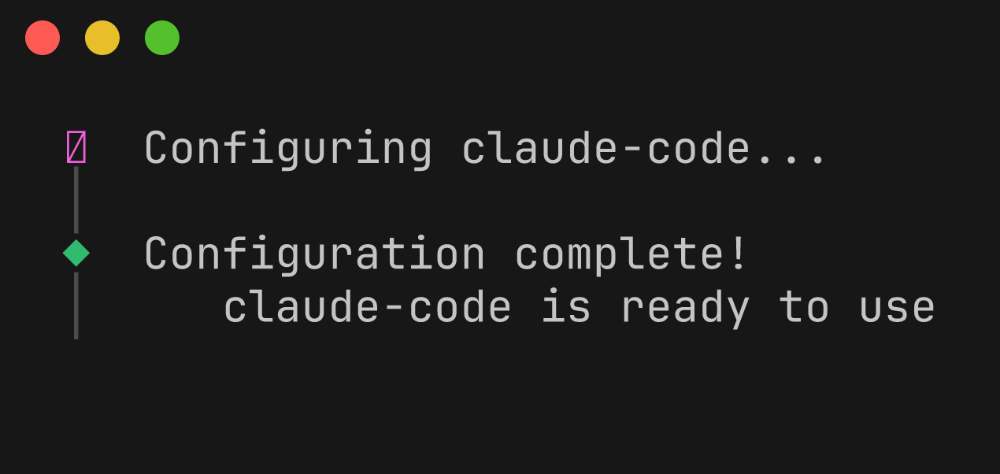

### spinner-timer

Timer spinner showing elapsed time

```typescript
import { renderSpinnerFrame, renderSpinnerStopped } from "toolcraft-design";
const frame = renderSpinnerFrame({ message: "Processing...", timer: "1s" });
const stopped = renderSpinnerStopped({ message: "Complete!", timer: "2s" });
```

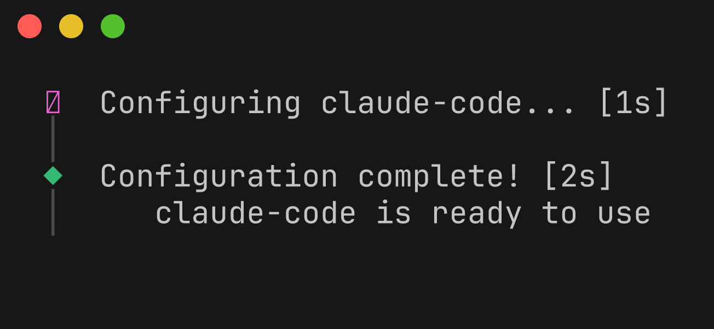

### table

Styled terminal table with themed borders and column alignment

```typescript
import { renderTable, getTheme } from "toolcraft-design";

const output = renderTable({
  theme: getTheme(),
  columns: [
    { name: "Model", title: "Model", alignment: "left", maxLen: 30 },
    { name: "Context", title: "Context", alignment: "right", maxLen: 9 }
  ],
  rows: [{ Model: "<model-id>", Context: "<context>" }]
});
```

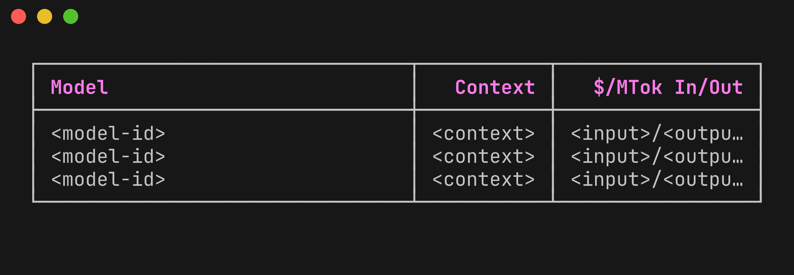

### diff

Unified diff display for file changes (used in --dry-run)

```typescript
import { color, log } from "toolcraft-design";
const diffLines = [
  color.gray("--- config.json"),
  color.red('-  "model": "old-model",'),
  color.green('+  "model": "new-model",')
];
log.message(diffLines.join("\n"), { symbol: color.yellow("~") });
```

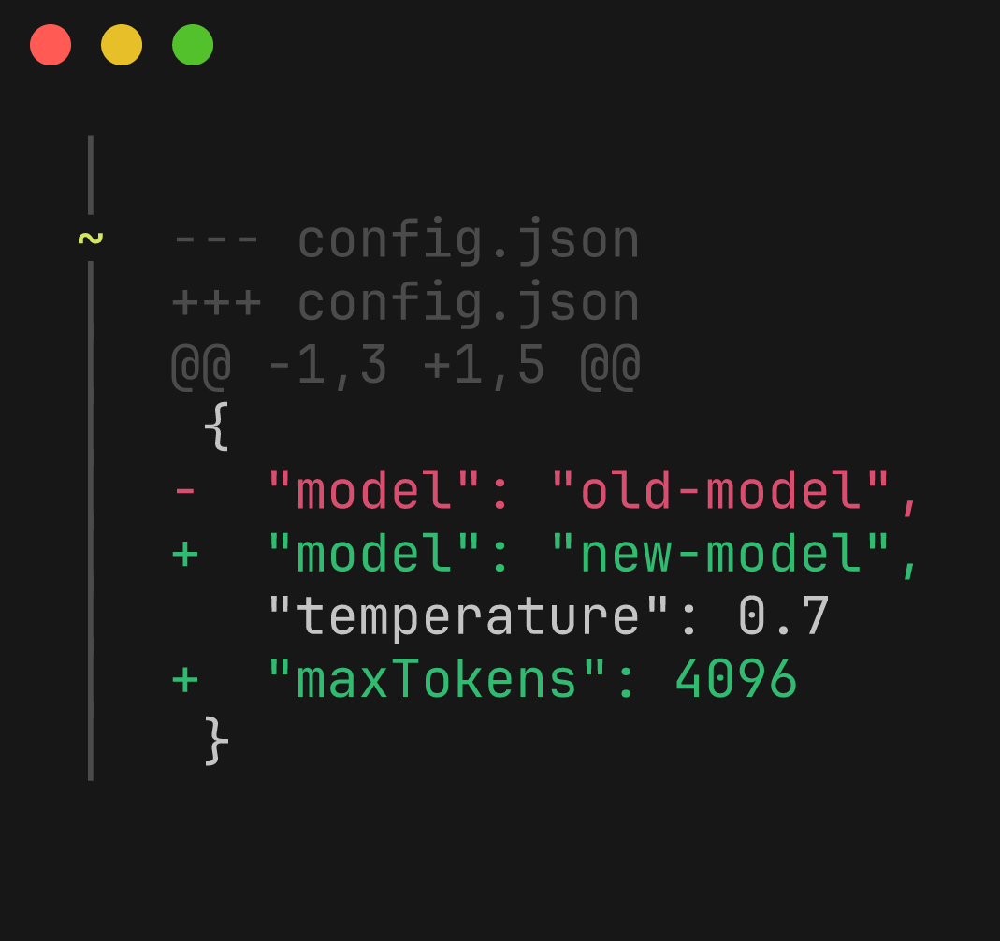

## Dashboard

Full-screen interactive terminal dashboard with output pane, stats pane, and keyboard navigation. Used for monitoring long-running agent sessions.

### dashboard

Two-pane dashboard layout with scrollable output on the left, live stats on the right, and keyboard hints in the footer

```typescript
import { createDashboard } from "toolcraft-design";

const dashboard = createDashboard({
  title: "Agent Output",
  statsTitle: "Stats"
});

dashboard.start();
dashboard.appendOutput({ kind: "info", text: "Analyzing repository state", ts: Date.now() });
dashboard.updateStats({
  status: "running",
  iterations: 5,
  tokensIn: 685,
  tokensOut: 445,
  elapsedMs: 5000
});
```

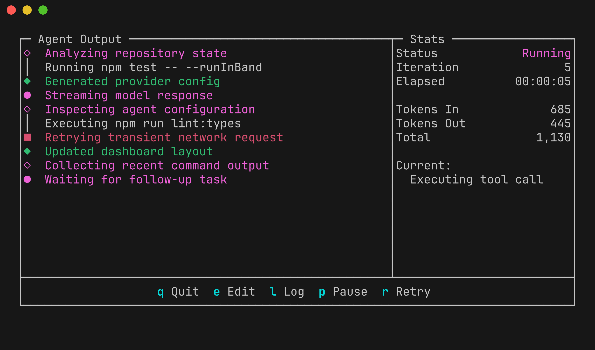

## Terminal Markdown

Reference demos for the terminal markdown renderer, covering both the full showcase and a minimal validation sample.

### terminal-markdown

Full markdown renderer showcase with headings, lists, tables, blockquotes, alerts, links, and footnotes.

```typescript
import { renderMarkdown } from "toolcraft-design";

const markdown = [
  "# Design System Markdown",
  "",
  "Paragraph with **bold** text and a [docs link](https://example.com/docs).",
  "",
  "- unordered item",
  "1. ordered item"
].join("\n");

process.stdout.write(renderMarkdown(markdown));
```

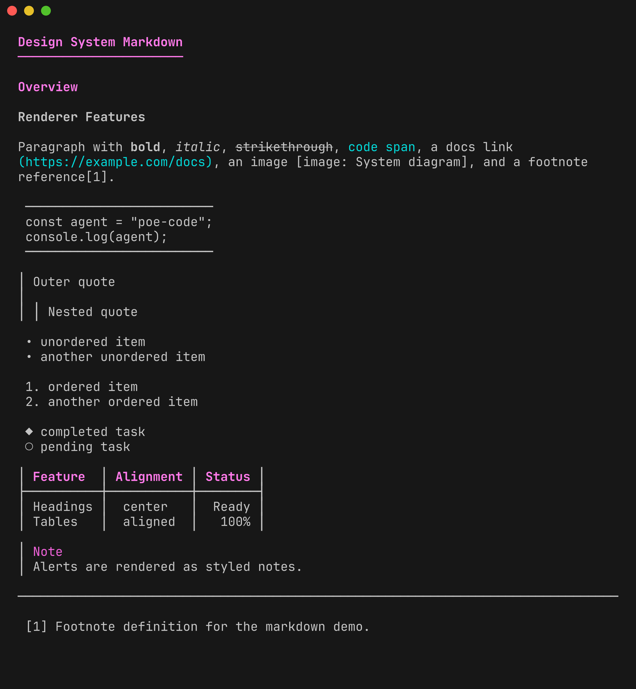

### terminal-markdown-minimal

Compact markdown renderer sample for quick validation of headings, prose, and fenced code blocks.

````typescript
import { renderMarkdown } from "toolcraft-design";

const markdown = [
  "# Markdown Minimal",
  "",
  "Quick validation",
  "",
  "```js",
  'console.log("demo");',
  "```"
].join("\n");

process.stdout.write(renderMarkdown(markdown));
````

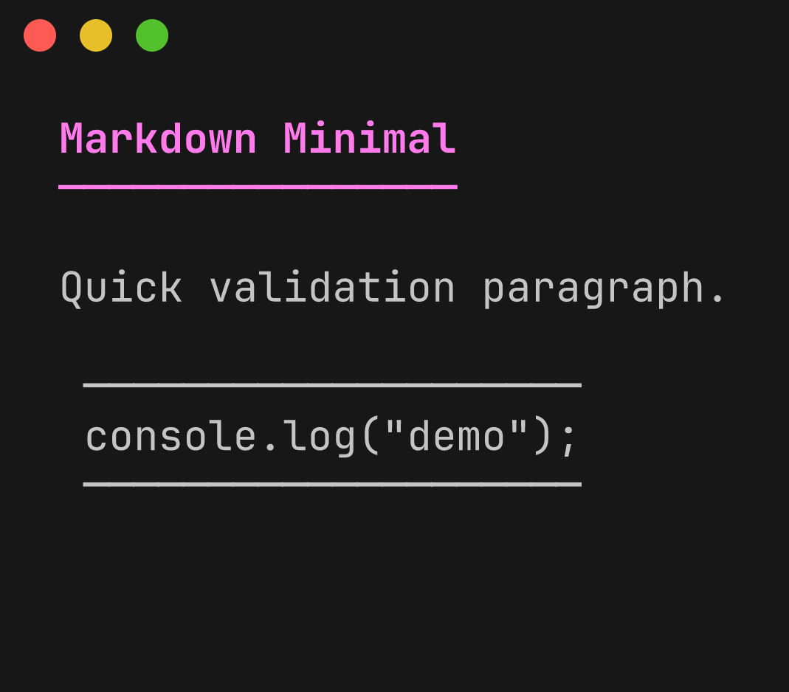
