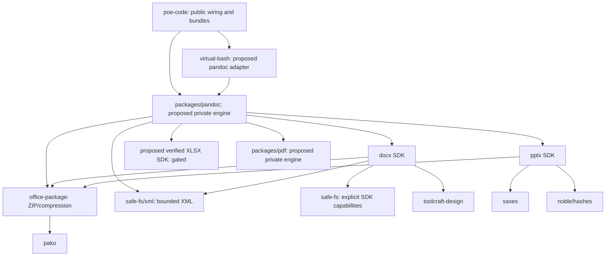

# TypeScript converter dependency architecture

Inspected on 2026-09-16 at local main `3b0f790c7664275b292732dbb63012081fca2f1b`.
This resolves package ownership only. No converter workspace, command, format adapter,
or PDF engine is delivered by this milestone. The conversion contract is
[contract.md](contract.md); editor specifications remain independent.

## Existing owners and exact seams

| Owner | Existing symbols / source | Decision |
| --- | --- | --- |
| `@poe-code/office-package` (private) | `src/index.ts` exports `createZipCodec`, `ZipLimits`, `ZipRuntime`, `ZipProfile`, `ZipEntry`, `ZipArchive`, `crc32`, `createCompressionCodec`, `CodecError`; package exports `.`, `./zip`, `./compression` | Shared bounded binary codec owner. `createZipCodec()` returns `readZipArchive`, `decodeZipEntry`, `makeZipEntry`, `writeZipArchive`. Use this seam for EPUB; Office adapters reach it through their SDKs. |
| `@poe-code/safe-fs` (private) | `src/core.ts` exports `parseXml`, `parseXmlSteps`, `XmlLimitError` and XML types; package `./xml` is the narrow XML route | Existing shared bounded XML owner. DOCX `package-xml.ts` imports `parseXmlSteps` through `@poe-code/safe-fs/xml`; the xml shell command imports through `poe-code/safe-fs/core`. Use the narrow parser, never FS implementations or shell queries. |
| `docx` (private) | `src/index.ts`: `Document`, `DocumentView`, `createDocument`, `readDocumentArchive`, `writeDocumentArchive`, `DocumentLimits`, `DocumentBudget`, `DocumentPackage`, `parseDocumentXmlAsync` | Word model and OPC admission remain SDK-owned. `DocumentView.save(sink)` is an existing writer seam. AST mapping needs independent verification, not a new Word model. |
| `pptx` (private) | `src/index.ts`: `Presentation`, `PresentationModel`, `PresentationContext`, `createPresentation`, `readPresentationText`, `readNotes`, `ByteContext`; `./bytes` exists | Presentation model, parts/relationships, and slides remain SDK-owned. Existing model `save()` returns bytes or writes a sink. `package-reader.ts` / `package-writer.ts` import shared ZIP; `xml.ts` uses `SaxesParser` from `saxes`. |
| `virtual-bash` (private safe-bash) | `src/contracts/{command,io,filesystem}.ts`: `CommandContext`, `CommandDefinition`, `ByteSource`, `ByteSink`, `FileSystem`; `contracts/index.ts` exposes `readBytes`, `writeBytes`, `createOutputOperation` | Adapter-only invocation, VFS, publication, cleanup, diagnostics and byte ownership. Do not pass `CommandContext` into the converter. |
| html-to-markdown | `Parser`, `HtmlNode`, `Renderer`, `Budget`, `Inputs` are internal modules; public command factories are `createHtmlToMarkdownCommand`, `createHtmlToMarkdownCommands`, `htmlToMarkdownCommands` | Leave unchanged. Not a portable HTML5 parser or a converter AST. |
| archive | `src/commands/archive/zip-format.ts` has its own `ZipEntry`, `ZipArchive`, `crc32`; compression `codec.ts` wraps shared `createCompressionCodec` | Legacy ZIP implementation is shell-coupled (contracts, archive diagnostics, compression adapters and ZIP64 helpers). Do not import or copy it into pandoc. Consolidating existing archive behavior is separate work. |
| xan | `src/commands/xan/csv.ts`: `Scanner`, `Cell`, `RecordRow`; factories `createXanCommand`, `createXanCommands`, `xanCommands` | Bounded byte-oriented CSV scanner, coupled to `Budget`, `Bytes`, shell `readBytes` and `Subcommand`. Count dialect has different quoting semantics. Not an XLSX SDK or a reusable strict CSV API. |
| xml command | `parseQuery`, `evaluate`, `serialize`, `XmlBudget` are command internals | XPath-like selection and shell serialization do not implement document-format reading. Reuse shared XML parsing only where namespace/entity/encoding semantics fit. |

OPC is currently implemented in the sibling SDKs (`docx` package/admission/part-URI
modules; `pptx` package reader/writer/view modules), not exported by office-package.
The latter's name does not imply a universal Office model. No new universal model
or second spreadsheet/presentation model is authorized. ZIP and XML have different
existing shared owners; any future OPC consolidation belongs with those owners and
must preserve SDK behavior, rather than being invented inside the converter.

## Proposed acyclic graph

Arrows mean imports/dependency direction. All nodes marked proposed are absent.

This is the intended conversion runtime graph, not a census of every unrelated
repository dependency. Its topological order is root, shell adapter, pandoc,
sibling SDKs/pdf, shared codec/parser/capability owners, their external leaves.
No leaf may import pandoc, safe-bash commands or root. Published import spelling
through `poe-code/safe-fs/core` is root wiring, not permission for the XML source
owner to depend on root logic. Build graph checks must distinguish these aliases
from source dependencies. Office SDK UI dependencies exist today; pandoc must not
call editor command/transport APIs to implement conversion.

Proposed exact names from the conversion plan: private `packages/pandoc` with
`readDocument`, `writeDocument`, `convert`; thin
`packages/safe-bash/src/commands/pandoc`. These symbols have no implementation or
export today. No `createPandocCommands`, EPUB SDK, PDF API or XLSX API is claimed
as existing. The eventual adapter validates argv using SDK validation, maps explicit
VFS byte/resource capabilities, propagates cancellation, awaits sink backpressure,
and maps typed diagnostics to exit status. It contains no parsing or layout logic.
The engine owns its AST, format readers/writers, conversion orchestration, loss
policy and deterministic metadata/media mapping; no host filesystem, env, fetch,
native subprocess, WASM Pandoc or network fallback.

EPUB owns container.xml, OPF manifest, spine, navigation, XHTML/CSS and media rules
inside pandoc. It shares ZIP, not OPC relationships/content types. PDF's proposed
private owner owns font metrics, line breaking, pagination, layout and PDF objects /
serialization. Pandoc supplies AST-to-layout mapping and explicit font/resources;
PPTX text-fit metrics do not establish a PDF engine.

## Reuse measurement

See [html-parser-probes.md](html-parser-probes.md) for five original in-memory
structural probes. Four expose specific HTML5 tree differences; the fifth checks
foreign names/namespaces. All five matched between whole-input and character
chunks under the isolated probe. This is not HTML5 conformance, renderer parity,
entity coverage, resource-bound verification or a browser-runtime pass.
`Parser` uses `Buffer.byteLength`; `Budget` depends on `CommandContext`, `FsError`,
`yieldTurn` and shell sinks. Extraction is gated on an original HTML5 tree corpus,
portable byte accounting and independent unchanged-command regression evidence.
No extraction occurs here. Existing raw-text dropping, recovery rules, diagnostics,
limits, output bytes, multi-input behavior and registration must remain observable.

CSV/TSV reuse is gated on contract-specific quoting, UTF-8/BOM, CRLF, empty fields,
ragged records, cancellation, owned chunks and work limits, plus separating scanner
policy from command dialects without importing shell internals. XML reuse requires
namespace-aware strict parsing and bounded DTD/entity behavior appropriate to each
format; XML cannot substitute for HTML5 recovery. Shared ZIP admission must retain
member, entry, total expanded-byte, archive-byte, name, depth and work bounds,
duplicate-name rejection, CRC/payload validation and cancellation. EPUB additionally
needs first stored mimetype member and deterministic explicit dates; verify these
against `writeZipArchive` before advertising EPUB output.

## Absent dependencies and activation gates

| Gate | Current evidence | Required before activation |
| --- | --- | --- |
| Converter | No `packages/pandoc` or pandoc command directory | Later workspace task: original failing tests, built public API, narrow capability validation and maintained checks. Package README additions require explicit permission. |
| XLSX read | No XLSX workspace/typed SDK found in package declarations or package paths | A delivered sibling read SDK with exact public exports, workbook/cell types, bounded package admission and original consumer tests. Embedded chart-workbook support and Python bridges are not substitutes. No XLSX writer. |
| DOCX/PPTX conversion | Existing source exports and scoped editor milestones; specs still proposed | Verify built consumer seams and original AST read/write mappings, feature/loss gates, resource limits and preservation. Source presence alone does not activate either format. |
| ZIP proposal | DOCX plan `shared-zip-read` proposes `packages/zip`; that path is absent | Use delivered office-package API above. Do not create an extra archive parser to satisfy the historical proposed name. |
| PDF output | No `packages/pdf` or verified equivalent found | Deliver bounded portable layout/PDF engine and exact exported layout/font contracts; independent line-break, pagination, font-metric and PDF-object tests. No native renderer fallback. |
| PPTX plan | Requested `docs/plans/pptx-typescript-safe-bash.md` is absent; filename search found no alternate PPTX plan | Restore/provide the actual plan before claiming it inspected or reconciling its task states. Current SDK/spec inspection is recorded separately. |
| Build/publication | Existing root bundles only | New workspace closure, public-export declarations, bundling and declarations must be verified in their later integration task. |

## Dependency cost and portability

No parser dependency is added. Text engine code should aim for zero product
libraries. Existing shared ZIP already depends on `pako@3.0.1`; PPTX depends on
`saxes@6.0.0` and `@noble/hashes@2.4.0`. This makes Office/EPUB activation nonzero-cost.
Pako uses JavaScript compression, not host executables; office-package uses typed
bytes, TextEncoder/TextDecoder and explicit runtime hooks. Package license is MIT;
external license/notice and exact shipped size must be checked in the actual bundle,
not inferred from workspace license. Saxes is an XML parser, not HTML recovery.
No installed dependencies are available here to measure minified/compressed runtime
sizes. Those measurements and browser/workerd consumer runs remain pending.

If an HTML5 parser becomes necessary, approval review must document exact version,
license and notices, Node/browser/workerd requirements (including Buffer/polyfills),
uncompressed/minified/compressed shipped size and transitive graph. Bound input,
tokens, nodes, depth, attributes, retained bytes and total work before allocations;
check cancellation at bounded intervals. An uninterruptible library parse needs a
proven input/work ceiling or a legitimate bounded worker capability. A library's
marketing description is neither portability evidence nor local dependency approval.

## Validation scope

Documentation-only change; no product code or config changed. Source/export reads
and original in-memory structural probes validate the decisions above. Full unit,
build, lint and visual CLI gates are not claimed: there is no CLI visual change,
and local `tsx` is unavailable. Procedures and task status are in
[the owned milestone record](../plans/pandoc-package-boundaries.md).
