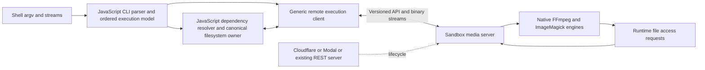

# JavaScript media CLI with native execution in remote sandboxes

## Scope

Build JavaScript FFmpeg/ffprobe and ImageMagick shims for safe-bash. Native
media processing runs in Cloudflare Sandbox, with Modal and generic REST support.
Preserve CLI grammar, nested dependencies, directory layout, streams and file effects.
Target noninteractive safe-bash. All required noninteractive shell and media semantics
must pass qualification; missing support is work to complete, not a scope exception.

Planning only. Implementation and deployment are deferred. All 29 tasks are stepless.

## Architecture and ownership



Selected structure: **two new packages**, using the existing safe-fs and safe-bash
contracts. Protocol and server code are separated by subpath exports rather than
another workspace. Package/API spellings below are proposed, not existing exports.

| Owner | Responsibility |
| --- | --- |
| `media-cli` | JS command shims, dependency parsers/resolvers, native version/option manifests and media-specific server bootstrap/image |
| `remote-execution` | Shared protocol, portable client, uploads/materialization, job/file/stream semantics, Node server and isolated provider drivers |
| safe-bash plugin | Adapt existing command/stream/filesystem contracts; register explicit native command names |
| root SDK/CLI | Public configuration and wiring only |

Provider configuration is declarative. A new provider using an existing transport
driver should require one definition file, with no switches elsewhere. Truly new
transport behavior belongs in a reusable driver; tool grammar must never depend
on provider identity. No speculative universal plugin framework is needed.

Current integration seams inspected: `contracts/command.ts` and
`getCommandArguments`, `contracts/plugin.ts`, `contracts/output.ts`,
`contracts/filesystem-descriptor.ts`, safe-fs canonical contracts, `core.ts`,
`src/sdk/bash.ts` and `src/cli/commands/bash.ts`. Existing Python configuration is
not a media frontend and must not become the implementation owner.

```text
packages/
  media-cli/
    src/
      index.ts                 # portable media execution SDK
      ffmpeg/                  # shim, option scope and dependency resolution
      imagemagick/             # shim, ordered path syntax and file resolution
      dependency-graph/        # media-specific dependency evaluation
      tool-definitions/        # pinned native command/build/capability descriptions
      server.ts                # composes remote-execution/server with media tools
    deploy/                    # media container image and provider entrypoints
    README.md                  # draft first; addition requires user's permission
  remote-execution/
    src/
      protocol/                # common validation and HTTP/binary schemas
      client/                  # platform-neutral sessions/jobs/files API
      transfer/                # uploads, manifests, integrity and revalidation
      jobs/                    # ordered effects, stream ownership and recovery
      server/                  # Node-only HTTP/WS, native process and materialization
      providers/               # declarative definitions and protocol-specific drivers
    README.md                  # draft first; addition requires user's permission
  safe-bash/
    src/commands/media/        # thin injected CommandDefinition adapter only
```

Dependency direction is `media-cli -> remote-execution`. The generic server receives
tool definitions; it never imports media-cli. The media server entrypoint imports
`remote-execution/server` and supplies the tool configuration. The root SDK injects
the constructed engine into safe-bash; safe-bash imports neither new package as an
implicit runtime dependency. This follows the existing injected-engine pattern
without copying the PPTX adapter's whole-file buffering into media pipelines.

`remote-execution/protocol` and `/client` must import no Node/process/provider SDK
code. `/server` is Node-only. Provider SDK dependencies belong behind explicit
provider imports. This supports browser-side clients without bundling a server
and avoids circular dependencies or a third contracts package.
A separate Worker-compatible provider export holds the Cloudflare Sandbox binding
adapter. Container-only dependencies must never enter that import graph. The generic package
implements the execution features required here, not an unrelated orchestration framework.

Existing alternatives inspected and deliberately not adopted wholesale:

| Existing package/file | Reuse decision |
| --- | --- |
| `agent-harness-tools/src/execution-env.ts` | Agent runtime/config/job orchestration and host/docker selection; do not couple portable media to it |
| `process-runner/src/types.ts`, `host/host-runner.ts` | Consider only for server-side native process launch; qualify spawn errors, signal exit and termination escalation before reuse |
| `process-runner/src/workspace-transfer.ts` | Whole-workspace, host/Buffer-oriented transfer does not provide canonical dependency-only materialization or live effects |
| `toolcraft-openapi/src/http.ts` | Current binary response collection/base64 and multipart buffering are unsuitable for media streams; optional administrative clients only where qualified |
| `safe-bash/src/commands/pptx/index.ts` | Useful dependency-injection boundary; buffered artifact publication and atomic-edit requirements are not media stream semantics |

## Design constraints that decide correctness

1. **Original grammar, not filename guessing.** Parse ordered FFmpeg option groups
   and ImageMagick path-bearing syntax for discovery. Native tools retain execution
   and validation authority. Derive versioned metadata from pinned
   source and native capability tables. Use real parsers for embedded languages.
2. **One authoritative filesystem.** Remote local files are temporary materializations.
   Canonical storage defines rights, identity, access errors and visible effects.
   A synchronization shortcut must not change semantics silently.
3. **Preserve error and effect order.** Finding an invalid later dependency during
   prefetch must not change an earlier native error, prompt or output side effect.
   Preflight discovery cannot become permission to eagerly open/truncate everything.
4. **Runtime dependencies remain required.** Static resolution cannot fully replace
   accesses triggered by decoded metadata, reloads, delegates or changing playlists.
   Prove a server file-request hook that lets JS resolve and materialize them at the
   actual access stage. A failed command restarted after copying a file is not equivalent.
5. **Preserve ordinary command spellings.** No special user-authored input manifest
   for commands that work natively. Operational configuration belongs to the plugin/SDK,
   outside native argv. Shell expansion/redirection is performed once by the shell.
6. **No unearned compatibility.** Same codec build, font assets, locale, policy and
   delegate availability are part of the oracle identity. Hardware, local devices,
   network locality and descriptor gaps cannot be erased by passing a file test.
7. **Native execution stays remote.** Existing rules prohibiting local native process
   escape remain intact; the user explicitly authorizes the remote-native architecture.

The native executable is authoritative for command validation and media processing.
JavaScript parses for dependency discovery and remote transport; independently test
that discovery and compare the complete shim with native execution. Dependencies
whose names depend on decoded media are discovered through runtime file access,
not a second JS image-processing state machine or custom native media ABI.

## Proposed API outline

These endpoints are a design sketch to validate in the contract task, not shipped APIs.

| API operation | Essential behavior |
| --- | --- |
| `GET /v1/capabilities` | Protocol/native build, option-table/config identity, codecs/coders/delegates, resource and provider capabilities |
| `POST /v1/sessions` | Scoped workspace and lifecycle; no global shared writable directory |
| `POST /v1/sessions/{id}/uploads` | Resumable binary upload with identity/integrity and bounded chunk sizes |
| `PUT /v1/sessions/{id}/uploads/{uploadId}/content` | Binary chunks with declared offsets and acknowledged progress |
| `POST /v1/sessions/{id}/uploads/{uploadId}/finalize` | Verify size/hash, return a session-scoped complete blob handle |
| `POST /v1/sessions/{id}/materializations` | Build and verify the exact directory tree from an explicit manifest and uploaded blobs |
| `GET /v1/sessions/{id}/materializations/{materializationId}` | Readiness, revision, logical cwd and materialization errors |
| `GET /v1/sessions/{id}/files` | Scoped listing/metadata, not an unrestricted server filesystem browser |
| `POST /v1/jobs` | Idempotency identity plus original argv, ordered invocation, cwd/env and stream/file bindings |
| `GET /v1/jobs/{id}` | Accepted/running/exited/I/O-settled/unknown outcome with actual process status |
| `GET /v1/jobs/{id}/stream` | WebSocket upgrade for binary stdin/out/err, fd channels, dependency requests and acknowledgments |
| `POST /v1/jobs/{id}/signals` | Explicit signal/cancellation and acknowledgment; HTTP abort is not process termination |
| `GET /v1/jobs/{id}/outputs` | Effect/partial-output manifest, retained identity and settlement status |
| `GET /v1/sessions/{id}/files/{handle}/content` | Authorized range/binary retrieval tied to retained object identity |
| `DELETE /v1/sessions/{id}` | Defined cleanup after ownership settles; never discard acknowledged canonical writes |

REST and provider-native bootstrapping coexist. Cloudflare/Modal SDKs provision
and connect to the same server; the media client need not inherit provider SDK
limitations on text logs or stdin. Use frame types for control versus media bytes,
with per-channel flow control, offsets and bounded replay. Represent raw argv/path
bytes explicitly where required; JSON strings alone do not preserve arbitrary
non-UTF8 shell values. Reject embedded NUL according to the source contract.

An execution may finish natively while output transfer remains unresolved. Preserve
those two states. A reconnect may resume the same job, but an irretrievably lost
sandbox creates an unknown/failed outcome, not a justified automatic rerun.

### Explicit upload and directory materialization workflow

The API supports this independently of the CLI:

1. Create a session and an authorized logical workspace root.
2. Upload dependency bytes, resume interrupted uploads, then finalize verified blobs.
3. Submit a manifest specifying directories, file-to-blob bindings, symlinks and cwd.
4. The server builds the private physical tree and reports a ready materialization
   identity/revision. It does not flatten basenames or invent output directories.
5. Execute a job bound to that identity, original argv and logical cwd.
6. Resolve any late dependency through the same scoped API without restarting the job.
7. Inspect outputs/effects and retrieve the correct output tree, including partial
   results when the native process fails.

Illustrative manifest; blob names and source revisions are placeholders returned
by the actual upload/source APIs, not hardcoded protocol values:

```json
{
  "logicalRoot": "/work",
  "cwd": "/work",
  "revision": "revision-1",
  "entries": [
    {"path": "edit", "kind": "directory"},
    {"path": "edit/lists", "kind": "directory"},
    {"path": "clips", "kind": "directory"},
    {"path": "out", "kind": "directory"},
    {"path": "edit/lists/cut.ffconcat", "kind": "file", "blob": "uploaded-list", "freshness": "revalidate-on-open"},
    {"path": "clips/part one.mp4", "kind": "file", "blob": "uploaded-part-one", "freshness": "revalidate-on-open"},
    {"path": "clips/part two.mp4", "kind": "file", "blob": "uploaded-part-two", "freshness": "revalidate-on-open"}
  ]
}
```

The resulting logical namespace must be:

```text
/work/
  edit/lists/cut.ffconcat
  clips/part one.mp4
  clips/part two.mp4
  out/
```

Thus `../../clips/part one.mp4` inside the list resolves correctly. A physical
job directory is an implementation detail; the native process must observe the
logical namespace consistently for both absolute and relative names. Merely
setting cwd to a prefixed physical path does not solve absolute path semantics.
The proof task must qualify the namespace mechanism and delegate visibility.

Final schemas also include verified size/digest, source authority/version and
byte-path encoding where required. This short example omits those details for
readability. The `out` directory is present because it already exists in the
canonical fixture. If absent canonically, materialization must not create it and
change a command that should fail into one that succeeds.

Directory readiness verifies physical staging, not indefinite freshness. Live or
mutable files require canonical revalidation/access mediation at the original
read stage. Upload snapshots cannot silently replace that guarantee. Manifest
revisions cannot replace files underneath native retained handles. Failed or
partly built materializations cannot start a job as a ready revision.

Directory edge cases include equal basenames in separate folders, empty directories,
input/output aliases, symlinks with in-scope `..` targets, unauthorized escapes,
case/Unicode distinctions, file/directory collisions, stale revisions, missing
blobs, partial upload, hash mismatch and concurrent jobs using the same relative
names. Building the private staging tree may be atomic internally; canonical
command effects remain ordered native effects, not a multi-file transaction.

## Sophisticated acceptance examples

These commands are proposed native-oracle fixtures, **not commands executed during
planning**. The implementation must run and correct each fixture against the selected
native build before recording a pass. Options/codecs/assets must be present in that
fixture's pinned build. Tests use original tiny media, fonts/profiles with known
licenses, private temporary workspaces and explicit remote execution authorization.
All examples also run through the public JS frontend and SDK, not only native CLI.

### A. Multiple inputs, filter graph and independent output option groups

```sh
ffmpeg -hide_banner -y -ss 1.25 -i 'clips/interview café.mp4' \
  -loop 1 -i 'assets/logo mark.png' -i 'audio/music bed.wav' \
  -filter_complex '[0:v]scale=1280:-2[base];[1:v]scale=160:-1[logo];[base][logo]overlay=W-w-24:H-h-24[v];[0:a][2:a]amix=inputs=2:duration=first[a]' \
  -map '[v]' -map '[a]' -t 4 -c:v libx264 -crf 22 -c:a aac 'out/review.mp4' \
  -map 0:a:0 -t 2 -c:a pcm_s16le 'out/dialogue.wav'
```

Assert input-index stability, -ss scope, output-specific duration/codec state,
logo placement, audio sample/timestamp behavior and both outputs. Error variants:
missing audio stream, malformed graph, missing logo and unwritable second output.
Compare which output effects exist when the second output fails; do not invent
all-or-nothing publication. Fixture input has a known audio stream.

### B. Concat dependencies resolved relative to a manifest

```text
# edit/lists/cut.ffconcat
ffconcat version 1.0
file '../../clips/part one.mp4'
inpoint 0.5
outpoint 1.5
file '../../clips/part two.mp4'
```

```sh
ffmpeg -f concat -safe 0 -i edit/lists/cut.ffconcat -c copy out/joined.mp4
```

Assert the two paths are based on the manifest location, not cwd; preserve compatible
stream headers and native timestamp behavior. Add escaped quotes, CRLF/BOM variants,
missing later entries, absolute file references, repeated file identity and cycles
where a supported nested format creates recursion. Do not assume inpoint/outpoint
stream copy produces exact frame-accurate duration. Assert against the oracle.

### C. File-loaded filter graph with secondary resources

```text
# filters/look.txt
[0:v]lut3d=file=assets/grade.cube,drawtext=fontfile=fonts/TestSans.ttf:textfile=titles/current.txt:reload=1:x=24:y=24[v]
```

```sh
ffmpeg -i clips/source.mp4 -/filter_complex filters/look.txt \
  -map '[v]' -an -c:v ffv1 out/titled.mkv
```

Assert graph-file parsing and each filter's actual resource-resolution base. Change
`titles/current.txt` through a second canonical filesystem client at a controlled
frame barrier; verify observed text changes and retained handle behavior against
native execution. Test font missing, empty text, invalid UTF-8, atomic replacement
versus partial rewrite, and escapes in filter path syntax. Do not rewrite the
graph using global string replacement or cache a live text file indefinitely.

### D. Numbered sequences and multiple output files

```sh
ffmpeg -framerate 24000/1001 -start_number 1001 \
  -i 'frames/shot_%06d.png' -vf 'fps=12,scale=320:-2' \
  'out/thumb_%04d.png'
```

Assert discovery/order of 001001 onward without uploading every matching-looking
file, output sequence naming and exact frame count. Test missing first/middle
frame, literal percent/brackets, shell-expanded versus tool-owned globs, very large
indices and output quota failure after several frames. Existing unrelated outputs
remain distinguishable from newly created files; do not collect by loose glob alone.

### E. Two-pass encoding across invocations

```sh
ffmpeg -y -i clips/source.mp4 -c:v libx264 -b:v 600k \
  -pass 1 -passlogfile 'state/two pass' -an -f null -
ffmpeg -y -i clips/source.mp4 -c:v libx264 -b:v 600k \
  -pass 2 -passlogfile 'state/two pass' -c:a aac out/twopass.mp4
```

Discover codec-generated passlog filenames and publish them canonically before the
second invocation reads them. Test stale/truncated logs, changed first-pass input,
concurrent runs using the same prefix and a failed first pass. Do not special-case
the prefix as exactly one dependency or silently reuse another job's statistics.

### F. HLS nested input and generated manifest/segment outputs

```sh
ffmpeg -i media/master.m3u8 -map 0:v:0 -map '0:a:0?' \
  -c:v libx264 -c:a aac -f hls -hls_time 1 -hls_list_size 0 \
  -hls_segment_filename 'out/seg_%03d.ts' out/index.m3u8
```

Use controlled original master/variant fixtures with relative paths, initialization
segments and an authorized encrypted-input fixture requiring a key resource. Check
manifest base URLs, segment order, live refresh, escaped/signed URLs and provider
network policy. No leaking keys or signed query credentials into evidence. Qualify
DASH and tee-muxer variants separately, including escaped nested destination options.
Observe progressive segment/manifest updates, not only final directory contents.

### G. Binary pipeline, independent stderr and nonseekable output

```sh
ffmpeg -i clips/source.mp4 -f nut -c:v rawvideo -an pipe:1 |
  ffmpeg -f nut -i pipe:0 -vf scale=160:-2 -f framemd5 pipe:1
```

Verify binary bytes never pass through text decoding, upstream backpressure and
concurrent job admission. Terminate the downstream consumer early and compare native
broken-pipe/exit effects. Test `-progress pipe:2` without merging stderr into stdout;
test a seek-required MP4 muxer on a pipe and preserve its native failure. Add extra
descriptor cases only when the host shell supplies them, retaining gaps otherwise.

### H. ffprobe structured output and option-specific parsing

```sh
ffprobe -v error -select_streams v:0 -read_intervals '1%+0.5' \
  -show_entries 'stream=index,codec_name,width,height:frame=pts_time,pict_type' \
  -show_frames -of json 'clips/interview café.mp4'
```

Compare selected fields, read-interval semantics, JSON encoding and statuses. Test
invalid writer parameters, empty selection, corrupt container metadata and missing
files. Field selection colons are grammar, not filename separators.

### I. ImageMagick nested groups, clones and multiple writes

```sh
magick 'images/source portrait.png' \
  \( +clone -resize '640x640>' -write out/preview.png +delete \) \
  -resize '128x128^' -gravity center -extent 128x128 out/avatar.webp
```

Assert clone/list lifetime, setting scope, preview before avatar, geometry semantics,
alpha and format options. Add -respect-parentheses variants, nested groups, empty
lists, mismatched parentheses and a late invalid operation after -write. Preserve
the earlier written preview when the native invocation does.

### J. Profiles, font files and text indirection

```sh
magick images/input.tif -profile profiles/input.icc -profile profiles/output.icc \
  \( -background none -fill white -font fonts/TestSans.ttf -pointsize 24 \
     -size 400x caption:@text/caption.txt \) \
  -gravity south -compose over -composite out/captioned.png
```

Fixture embeds or omits the source profile deliberately, so profile assignment
versus conversion is asserted separately. Test UTF-8 text, multiple lines, missing
glyphs, relative font paths and security policy refusing @file. Do not silently
override policy or substitute host fonts. Compare pixels with declared color
tolerances and inspect the result visually; metadata-only checks are insufficient.

### K. Animation, selectors and ImageMagick-specific status behavior

```sh
magick images/animation.gif -coalesce -resize '320x320>' \
  -layers Optimize out/small.gif
magick 'images/pages.tif[0,2]' -scene 7 'out/page_%02d.png'
magick compare -metric AE images/reference.png images/changed.png out/diff.png
```

Verify frame delay, disposal, transparency and loop metadata, not only frame count.
Test bracket selectors versus literal bracket filenames and native scene numbering.
For compare, distinguish image-difference status from execution error; a nonzero
status may coexist with a valid diff image and stderr metric. Do not discard it.

### L. In-place edits, path aliases and mid-command failure

```sh
magick mogrify -strip -resize '50%' 'images/first.jpg' 'images/second.jpg'
```

Test an unwritable/corrupt second file after a valid first file, symlink/hardlink
aliases, simultaneous readers, rename/unlink while open and temporary-file cleanup.
Compare actual per-file effects and replacement semantics with native behavior.
No blanket transactional rollback. Add script-mode fixtures using the pinned
ImageMagick script grammar to verify @ dependencies and one-token-at-a-time effects.

## Cross-cutting edge-case matrix

| Class | Required cases and observations |
| --- | --- |
| Argument fidelity | Empty arguments, repeated flags, negative numbers, native-specific -- behavior, leading-dash names, invalid UTF-8/raw bytes, NUL refusal, shell quoting once |
| Path semantics | Spaces/quotes/newlines, Unicode normalization distinctions, case sensitivity, absolute/relative paths, symlink-sensitive '..', file: URLs, coder prefixes, colons, percent/brackets, retained identity |
| Dependencies | Indirect scripts/lists, recursive references, manifests changing during execution, optional missing resources, fonts/profiles/delegates, per-format URL bases, late file reads |
| Outputs | Multiple outputs, no file output, patterns, in-place updates, shared input/output aliases, early truncation, overwrite prompts, partial failure, append/rename/unlink, sparse writes |
| Streams | Binary null bytes, short reads/writes, EOF versus idle, stdout/stderr isolation, extra fds, seekability, huge streams, slow/early-exiting consumers, shared concurrency limits |
| Lifecycle | Cancellation during every stage, SIGINT versus kill, delegates/process groups, reconnect before/after acceptance, expired replay, output settlement after process exit, lost sandbox |
| Cache/transfer | Partial chunks, hash mismatch, mid-transfer mutation, identity/version invalidation, unauthorized shared cache access, stale negative entries, offline missing bytes, range amplification |
| Backend | Memory, delayed backend, read-only, quotas, mounts, cross-mount rename, unsupported atomicity, caller capabilities unknown versus false, no host path leakage |
| Provider | Cold start/sleep/restart, endpoint expiry, interrupted credentials, networking policy, actual binary WebSockets, SDK version differences, standard versus VM capability |
| Native build | Codec/filter/coder availability, ImageMagick Q8/Q16/HDRI, font/delegate/policy differences, locales, threads/GPU nondeterminism, build mismatch before side effects |

safe-bash is noninteractive: no PTY, terminal resize or foreground terminal job control.
All required noninteractive behavior remains in scope, including extra descriptors,
stdin-driven command behavior, background execution where supported by safe-bash,
network-local endpoints and native device/GPU capabilities. Missing required support
must be implemented and qualified; a file-only subset does not complete this plan.

## Qualification and sequencing

Execution order: native inventory and contracts → package boundaries → minimal
end-to-end proof → required filesystem/descriptor contracts and shims → complete API
and providers → Worker host and SDK/CLI wiring → full compatibility corpus.
The proof may build the minimum protocol/server needed for one real round trip;
later API tasks complete that implementation. Every required behavior must be
qualified before full completion, regardless of when the first command works.


The early feasibility task prevents spending the entire project porting option
tables before proving dynamic file access and native effect ordering can work in
the chosen sandbox. The target remains JavaScript shims; a feasibility failure
does not authorize switching to a different architecture silently.

After contracts/proof: implement JS parsers and dependency resolution, canonical
materialization, server/streams/recovery, provider drivers, public surfaces and
full corpus verification. Milestones are useful progress reports, not parity claims.

Each corpus row records original fixture provenance, native build/config, original
argv and working directory, expected resolution/access/effect order, expected
status/streams/media properties, provider/backend and actual result. Native trace
tools are oracle evidence; they are not required by product users. Fast unit tests
must independently assert expected behavior rather than derive expectations from
the registry being tested. No network, LLM calls or host files in unit tests.

Compare exact deterministic bytes and statuses; for nondeterministic codecs use
decoded frames/audio, timestamps and narrow justified tolerances. Never remove
entire stderr lines or arbitrary output paths to hide semantic mismatches. Pin
locale/build where necessary. Record performance separately from correctness.

Inspect rendered frames, animations and image outputs, and CLI screenshots for
visible changes. Technical fixture imagery can be generated deterministically;
new artistic assets, if introduced, follow the user's image-reference requirement.

Full completion requires all inventoried required command families and observable
effects qualified, actual Cloudflare and Modal evidence, generic REST conformance,
public SDK/CLI parity, and maintained build/test/lint success. Unavailable providers,
unimplemented late access and unverified device/descriptor behavior are visible
blockers. Successful parser tests or native execution alone do not close the plan.

## Research evidence

[Fable review and resolved decisions](../remote-media/fable-review.md).


- [Safe-bash contract gaps](../remote-media/safe-bash-contract-findings.md)
- [Native source findings](../remote-media/native-research-findings.md)
- [FFmpeg error-ordering probes](../remote-media/ffmpeg-native-ordering-probes.json)
- [HLS redirect probe](../remote-media/hls-redirect-oracle.json)
- [Completion audit](../remote-media/completion-audit.md)

Qualify against a pinned native build, OS, filesystem backend and provider.
Check required capabilities together, including FUSE and GPU availability.

## Sources inspected and remaining investigation

Research date: 2026-09-14. Source snapshots below are not production build pins.

- [FFmpeg source snapshot](https://github.com/FFmpeg/FFmpeg/tree/639ee849526cfe61ceb312776335c245b98bd9d4): parser/option ownership to audit and pin against a selected release.
- [FFmpeg CLI](https://ffmpeg.org/ffmpeg.html), [formats](https://ffmpeg.org/ffmpeg-formats.html), [filters](https://ffmpeg.org/ffmpeg-filters.html) and [protocols](https://ffmpeg.org/ffmpeg-protocols.html): grammar and file/stream behavior starting points.
- [ImageMagick source snapshot](https://github.com/ImageMagick/ImageMagick/tree/2ed1b96b9bc71434f0c4e82e3c63fec029c684c6), [command processing](https://imagemagick.org/command-line-processing/) and [options](https://imagemagick.org/command-line-options/): ordered settings/list semantics and filename expressions.
- [Cloudflare Sandbox files](https://developers.cloudflare.com/sandbox/api/files/), [services](https://developers.cloudflare.com/sandbox/guides/expose-services/) and [1.0 preview processes](https://developers.cloudflare.com/sandbox/1-0-preview/processes/): SDK versions and transport capabilities require explicit selection.
- [Modal filesystem](https://modal.com/docs/guide/sandbox-files), [networking](https://modal.com/docs/guide/sandbox-networking) and [VM Sandboxes](https://modal.com/docs/guide/vm-sandboxes): generic service connection and deployment-specific filesystem capabilities.

No universal dependency-discovery API was found. Track upstream licensing when
porting source-derived behavior.

## Plan validation

`poe-code pipeline validate docs/plans/remote-media-cli.md`

29 tasks, each with scalar `status: open`. Schema validation only.
